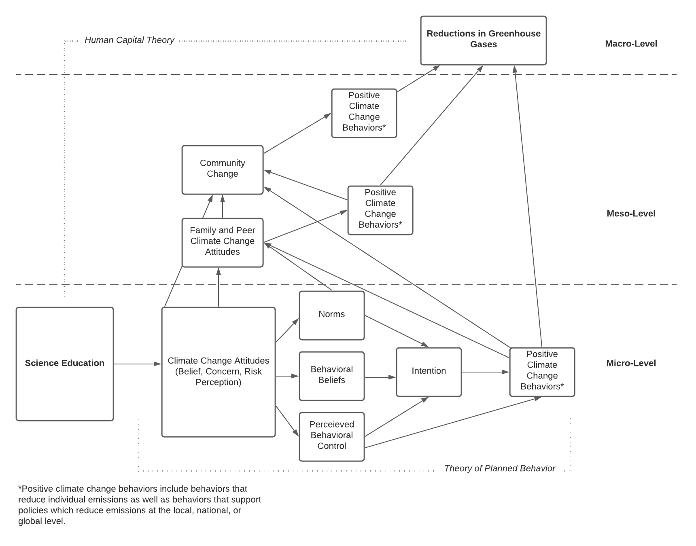
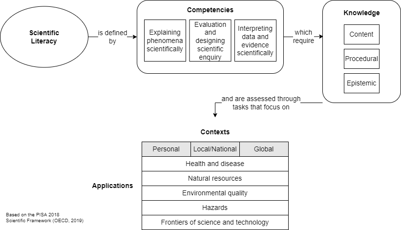
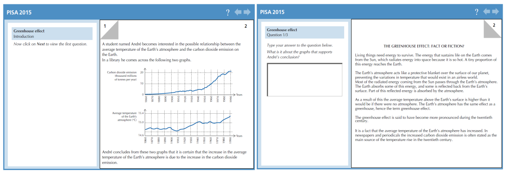

# CHAPTER TWO: Literature Review

  Education has long been considered a crucial element of social transformation [@desjardins2015a], whether that be as part of the modernization process or more acutely as a way to ameliorate social issues [@deboer1991; @liu2020]. The following literature review first presents a conceptual framework that outlines how science education and its derivatives may promote enough change at micro- and macro-levels to have a tangible impact on national carbon emissions. 

Following the presentation of a conceptual model, the review summarizes interrelated yet distinct areas of literature relevant to the present research. It is divided into two broad sections, reflective of the conceptual mechanisms that drive this research: micro-level effects and macro-level effects. Because climate change and education are both social phenomena arising from complex relationships that span individuals, communities, nations, and the entire globe, these sections are organized to reflect these phenomena's nested natures [@ehrhardtmartinez2015]. Research is first examined at the individual, or micro, level, drawing heavily on research in education and psychology. This section begins by discussing the PISA exam, science education, and the role education plays in affecting students' environmental awareness and attitudes. It then further examines education and pro-environmental behavior. The second section focuses on the macro-level, reviewing literature related to the broader national or cross-national impacts of education, with literature coming mostly from sociology.
  
## Conceptual Framework

The conceptual framework for explaining science education’s impact on climate change is primarily driven by human capital theory (HCT) and the theory of planned behavior (TPB). HCT views individuals as sources of "capital", particularly their knowledge and skills. Within an HCT framework, this capital is seen as the "key means by which both the individual accrues material advantage and by which the economy as a whole progresses" [@gillies2017, p. 1053]. Thus, HCT places great emphasis on education.

HCT posits that educational achievement leads to improved economic and social outcomes. It views education as instrumental and linear, with investments in learning made and social transformation returned [@gillies2017]. The evidence for this model is strong. Historically, increases in education have been connected to a number of positive societal changes. These include increased economic growth [@hanushek2010], improved population health outcomes [@baker2011], and increased democracy [@aleman2015], among others.

It is possible to view climate change through an HCT lens and see numerous avenues for mitigation. For example, there has been research that finds human capital is linked to renewable energy consumption and reduced carbon emissions [@bano2018]. The World Bank explicitly recognizes education's potential impact on the climate crisis via a human capital framework, arguing not only that education in general is important, but also science education:

>Education is an essential element of the global response to climate change. It can help people understand and address the impact of global warming; it also boosts their adaptive capacity and thus reduces vulnerability. STEM subjects in secondary education can help arm students with the skills to tackle climate change issues both now and in the future, while cutting-edge research in universities will be critical in delivering the climate-smart solutions of tomorrow. [@monslave2020]

While HCT is a useful explanatory framework for understanding the macro-level effects on society, it is not without its criticisms. HCT is seen as reductionist in nature, reducing education to only its economic worth, and humans to only what they are able to achieve for the economy through this education [@gillies2017]. Such views are certainly myopic. Furthermore, a focus on economic growth may not be in line with climate change mitigation. As discussed in Chapter 1, unfettered economic growth wrought by capitalism onto the natural environment is a major driver of climate change. Therefore, education in the present research is recognized as a diverse human experience influenced by varied social, economic, cultural, and political contexts. And, rather than seeing education as an economic input, it is acknowledged that education can exist separate from economics, with learning occurring from interactions with teachers, family, peers, and media. 

Additionally, while the benefits of education are interpreted through a traditional HCT lens as a "public good", this good is not necessarily seen in economic terms. Rather it is recast in terms of the fostering of sustainable living conditions at the societal level, with an emphasis on reducing greenhouse gas emissions. This falls in line with the notion that "returns on education investment are both personal and social," [@gillies2017, 1055], as sustainable outcomes that mitigate climate change affect both.

An additional criticism is that the model of social change HCT offers is too simplistic. HCT presents a linear path from individual educational attainment to macro-level societal effects without a satisfactory mechanism that explains how such change occurs. However, since its inception, HCT has been associated with rational choice theory [@becker1993; @gillies2017]. Rational choice theory essentially states that an individual makes decisions based on their preferences and beliefs [@satz1994]. A more modern version of this idea is the theory of planned action, which offers a robust explanatory mechanism to describe how micro-level changes have macro-level effects.

\newpage
  
```{r tpd, echo=FALSE, fig.cap="The theory of planned behavior model. Reproduced from deleeuw2015, p. 130."}
knitr::include_graphics("figures/tpd-deleeuw2.png")
```
\newpage

The theory of planned behavior (TPB) proposes a complex causal chain of psychosocial factors that results in a particular behavior (see Figure \@ref(fig:tpd)). Behavior is most directly driven by behavioral intention and perceived behavioral control. Perceived behavioral control reflects the extent to which one believes they can control a behavior. When this corresponds closely with actual control over a behavior, it has a direct influence on behavior. However, when it does not reflect actual control, it is considered more of a motivational mechanism that has an indirect effect on behavior through intention to act [@madden1992].

Intention to act is subsequently influenced by injunctive norms, descriptive norms, and attitude towards behavior. Both injunctive and descriptive norms refer to beliefs about others and can be construed as perceived social pressure to act [@newman2016]. Injunctive norms concern approval - perceptions of how others may judge one's behavior. Descriptive norms refer to the perception of others' behavior. Each of these factors that lead to intention to act are themselves linked back to related sets of beliefs. Importantly, attitude towards behavior is linked to beliefs about the outcome of behavior [@deleeuw2015].
 
This entire system is influenced by numerous background factors that include education, gender, beliefs, attitudes, and concerns. TPB has been used as an explanatory framework in research on pro-environmental behaviors, with a special focus on beliefs, attitudes, and concerns and how they can drive action [@yuriev2020]. While the effect of beliefs may arise earlier on the causal change toward behavior (see Figure \@ref(fig:tpd)), that does not diminish their impact. In fact, a parallel theory to TPD, the Value-Beliefs-Norm (VBN) theory also places great emphasis on beliefs as a driver of behavior [@dietz2005; @newman2016; @stern1999]. Beliefs operate by guiding what actions we are willing to take and help us judge the outcomes of those actions.

In terms of climate change, numerous studies have identified climate change beliefs, especially concern about climate change, as an important predictor of climate change-related behaviors [@hornsey2016]. In developing a model of climate change behavior among adolescents, @stevenson2018 demonstrate that climate change concern and hope influence behavior. In their model, climate change knowledge had an indirect effect on behavior, operating strongly through concern. 

Given the background factors that influence behavior [@deleeuw2015], education plays an important role in TPD. As will be explained in detail below (see [Micro-Level Effects]), science education (including environmental and climate change education) has strong influences on beliefs, attitudes, concern, and risk perceptions. Likewise, science education can also have an influence on pro-environmental and climate change behavior [@busch2019; @cordero2020; @geiger2019; @list2020]. These behaviors may be lifestyle changes, such as choosing alternative travel, flying less, purchasing green energy, or eating a plant-based diet [@wynes2018]. They may also be behaviors that promote systemic change through support of policies and voting [@unitednationsenvironmentprogramme2020; @wynes2021].

Education's effects do not stop at the individual. Increasing climate change concern via education is connected to both individual and collective action [@stevenson2019]. There is evidence that science education can influence peer and family member beliefs and actions as well [e.g., @lawsonChildrenCanFoster2019; @spiteri2020]. This moves the effects of knowledge and belief on behavior from the individual to the family, peer group, and beyond. Shifting behaviors and norms can act as a catalyst for wider change that influences the community [@bollinger2012; @carrico2021; @jachimowicz2018] and broader aspects of society, such as business and politics [@collins1988; @ehrhardtmartinez2015; @unitednationsenvironmentprogramme2020, p. 72]. These wider shifts can feed back into the TPD model, strongly increasing normative tendencies toward climate action. This explains why education is deemed a necessary step in averting the climate crisis [@reid2019]. This also intimates what is required to "wake up and change".

To summarize the conceptual framework underlying the present dissertation (see Figure \@ref(fig:conceptual)), this research draws on HCT to explain how, at the macro-level, scientific literacy may be associated with changes in national GHG emissions, namely CO~2~. To explain how such a link is plausible, and provide a micro-to-macro mechanism, the research also draws upon TPD, which offers a causal chain of explanations through which increased science education may influence positive climate change behaviors. Understanding that CO~2~ emissions are affected by much more than education, the HCT framework also incorporates the *IPAT* equation to consider other factors of influence [@yao2020]. This conceptual model does not portend to suggest science education can solve the climate crisis or generate an impact greater than other social phenomena. Rather, the model considers science education a necessary but not sufficient factor on the path toward social climate change solutions.

\newpage

```{r conceptual, echo=FALSE, fig.cap="The conceptual framework for the current dissertation research.", message=FALSE, warning=FALSE}

```
  
  \newpage

## Micro-Level Effects

According to @collins1988, micro-level analyses are concerned with "how people interact as human bodies in sight, sound and smell of each other...[and how]...we understand the larger and more long-term patterns when we see how they are composed of such micro-situations" (p. 242). Learning, whether informally at home or formally in school, is a fundamental human activity that takes place in the context of interaction. Education informs individual and household decision-making, which can come to have a real bearing on the larger world. For example, @ehrhardtmartinez2015 point out that decisions regarding fertility made at this level "add up, producing large aggregate impacts on national and global climate emissions" (p. 208). They argue that the micro-level agents play some role in determining their emissions and "can be mobilized in a variety of ways to leverage lower emissions" (p. 204). Decision-making such as this is done using the knowledge, beliefs, and attitudes (i.e., education) at one's disposal. Thus, education forms the perfect context to begin examining micro-level effects on climate change.

### What is the PISA?

The Programme for International Student Assessment (PISA) is an examination sponsored by the Organisation for Economic Cooperation and Development (OECD) that is designed "to measure how well 15-year-old students approaching the end of compulsory schooling are prepared to meet the challenges of today’s knowledge societies" [@oecd2012, p. 16]. It has been administered every three years since 2000. In 2000, 28 OECD countries and 4 non-OECD countries participated [@oecd2001a]. In 2018, the last cycle that was administered, 37 OECD countries and 42 non-OECD countries participated [@oecd2019a].

The PISA focuses on three core domains: reading literacy, mathematical literacy, and scientific literacy. For each test administration cycle, one of these domains is presented as the major domain on which the majority of questions are based. The other two domains are presented as minor domains, garnering fewer questions and less test time. Science literacy was a major domain in 2006 and 2015. It was a minor domain in 2000, 2003, 2009, 2012, and 2018.

What makes the PISA distinct from other exams is that it is not a measure of skills learned in a specific amount of time or outlined in a specific curriculum (local, national, or otherwise). Instead, it is an examination that measures cumulative learning over students' lifetimes by asking them to apply their knowledge to personal, social, and global contexts. This learning is influenced not only by the formal and informal contexts a student has learned in but the education of previous generations as well as the socio-cultural-economic environments in which the students are raised [@oecd2019a]. Therefore, PISA results reflect the cumulative learning of a student and serve as a reflection of the society in which this learning has occurred.

To assess this learning, the PISA focuses on a continuum of *literacy* in the three broad domains mentioned above. Literacy is defined as "the knowledge, understanding and skills required for effective functioning in everyday life" [@organisationforeconomiccooperationanddevelopment2000, p. 9]. This literacy is seen as vital for full participation in society and reflects what students will do as future citizens [@bybee2008].

### What is Scientific Literacy?

Scientific literacy is developed through science education. This type of literacy refers to the ability “to engage with science-related issues, and with the ideas of science, as a reflective citizen” [@oecd2019, p. 102]. @bybee2008 argues that "the understandings and abilities associated with scientific literacy empower citizens to make personal decisions and appropriately participate in the formulation of public policies that impact their lives" (p. 567). Scientific literacy is so important that @bybee2008 goes on to argue that understanding science-related issues such as "ecological scarcity directly influences economic stability and social progress" (p. 568). The OECD itself establishes scientific literacy as extremely important, stating that "Scientific literacy matters at both the national and international levels as humanity faces major challenges in providing sufficient water and food, controlling diseases, generating sufficient energy and adapting to climate change" [@oecd2017, p. 20]. 

The PISA measures key cognitive abilities required to make informed decisions for interaction with science-related issues and for everyday life. According to the PISA science framework [@pisa2006; @oecd2017; @oecd2019], scientific literacy is defined by three core competencies: explaining phenomena scientifically, developing questions that can be answered through science, and drawing conclusions from data and evidence. Each of these competencies requires the use of different forms of knowledge. Content knowledge refers to students' understanding of ideas and information related to science and technology. Procedural knowledge refers to understanding the methods one would use to design enquiry and to obtain and analyze data. Epistemic knowledge involves the justification of scientific enquiry (including hypothesis building, advancing an argument) and judgment of evidence and conclusions.

These building blocks of scientific literacy are seen as crucial for making informed decisions that have local, national, and international consequences [@oecd2017]. In fact, the PISA utilizes topics and issues at these levels to form assessment tasks. While the PISA includes climate change, sustainability, renewable energy, and similar topics on the exam, it does not necessarily measure knowledge of these directly. Rather, such topics are set within *applications*, five real-world areas which call for the application of scientific literacy: health and disease, natural resources, environmental quality, hazards, frontiers of science and technology. These applications are situated within three different *contexts*: personal, local/national, and global. These contexts represent "areas in which scientific literacy has particular value in enhancing and sustaining quality of life and in the development of public policy" [@oecd2019a, p. 105]. The combination of applications and contexts ensures items are relevant to students and capture the goal of the PISA's science assessment, which is using scientific literacy to address real-world science issues.

PISA's framework of scientific literacy and the relationships between competencies, knowledge, applications, and contexts are depicted in Figure \@ref(fig:pisaframework). \@ref(tab:pisacontexts) depicts examples of contexts and applications that are specifically relevant to climate change. Finally, Figure \@ref(fig:pisaexample) shows an example item from the PISA to illustrate the scientific literacy framework in action. This item assesses epistemic knowledge and requires the test-taker to demonstrate the competency of explaining phenomena scientifically. It is written at the global context level and requires application of scientific literacy to environmental quality.

Climate change is an important concept relevant to real-life at local, national, and global levels. It fits within a number of PISA applications and has been included in assessment items on the PISA. It is no leap of the imagination to see how having scientifically literate youth who can explain, interpret, and judge the science that informs climate change may have a bearing on the future of society. Furthermore, such an understanding is directly related to the original purpose of the PISA: “to measure how well 15-year-old students approaching the end of compulsory schooling are prepared to meet the challenges of today’s knowledge societies” [@oecd2012, p. 16]. There is arguably no greater societal challenge than climate change [@un2015]. Therefore, scientific literacy may serve as an important measure of society's ability to meet that challenge.

\newpage

```{r pisaframework, echo=FALSE, fig.cap="PISA Science Framework", message=FALSE, warning=FALSE}

```

\newpage


```{r pisacontexts, tab.cap = "Applications from the PISA scientific literacy assessment that are relevant to climate change.", echo=FALSE, message=FALSE, warning=FALSE}

tribble(~` `, ~Personal, ~`Local/National`, ~Global,
        "Environmental quality",
          "Environmentally friendly actions, use and disposal of materials and devices",
          "Population distribution, disposal of waste, environmental impact",
          "Biodiversity, ecological sustainability, control of pollution,
production and loss of soil/biomass",
      "Hazards",
        "Risk assessments of lifestyle choices",
        "Rapid changes (e.g., earthquakes, severe weather), slow and progressive changes (e.g., coastal erosion, sedimentation), risk assessment",
        "Climate change, impact of modern communication") %>%
  flex() %>%
  width(2:4, 2) %>%
  valign(valign="top") %>%
  add_footer_row(values = "OECD (2019), p. 105", colwidths = 4) %>%
  fontsize(size = 10, part="footer") %>%
  font(fontname = "Times New Roman", part="all")
```


\newpage

```{r pisaexample, echo=FALSE, fig.cap="An example item from the PISA Scientific Literacy assessment. Images reproduced from OECD, 2017, p. 33-34.", message=FALSE, warning=FALSE}

```


\newpage


***What is Environmental Literacy?*** At this point, it is important to briefly distinguish between scientific literacy, environmental literacy, and climate literacy. These three forms of literacy are not mutually exclusive and all of them may be borne from the broad field of science education or the related fields of environmental education and climate education. Environmental education is sometimes considered a subfield of science education; however, it is more often seen as distinct, with climate education often considered a subfield of environmental education. 

There are two primary differences between science education, which has its roots stretching back to the 19th century [@deboer1991], and environmental education, which begins roughly in the 1960s [@roth1992]. First, whereas science education focuses on broad concepts and skills across a range of domains, environmental education is premised on an ecological paradigm that focuses on environmental health and the role of human behavior [@roth1992]. To that end, the second, perhaps larger difference, is that environmental education also involves the formation of pro-environmental values and behavior change to improve environmental health [@wals2014]. Thus, there is a major attitudinal component to environmental education that science education generally lacks. Environmental literacy, therefore, can be seen as "the capacity to perceive and interpret the relative health of environmental systems and take appropriate action to maintain, restore, or improve the health of those systems" [@roth1992, p. 10]. 

To reiterate, scientific literacy and environmental literacy are not mutually exclusive. Kaya and Elster [-@kaya2018] argue that environmental literacy is part of scientific literacy. Recall that one of the aims of scientific literacy is to ensure individuals can engage with science-related issues. Environmental literacy provides such a capacity - one focused on ecological health. Likewise, science education curricula often include environmental education. For example, in the United States, the semi-national Next Generation Science Standards (NGSS; adopted by 20 states) "make clear the argument that environmental education is not separate from mandated education priorities, but should be integral to them" [@simmons2015, p. 5]. It also appears, to varying degrees, in other national curricula [e.g. @derman2018].

@kaya2018 also make the case that the PISA framework can provide some assessment of environmental literacy. The PISA includes questions on numerous environmental issues (recall the contexts and applications above). However, it does not assess it directly. Nevertheless, PISA 2006 and PISA 2015 included questions related to environmental awareness, concern, and responsibility, allowing for assessment of aspects of environmental literacy [@oecd2017]. Relevant research is discussed below.

***What is Climate Literacy?***  Though there is little empirical evidence directly correlating scientific literacy with climate literacy, the fact that they both independently correlate with climate change concern (research presented below) indirectly indicates an overlap. In addition, science education has been promoted by prominent science education policy organizations as a vehicle to introduce "social activism in students so that they become scientifically informed and socially responsible youth and adults" [cited in @skamp2013]. There is no doubt climate change is part of this activism, as it is the most pressing environmental issue of the time.

As the youth climate movement rapidly spreads around the world [@nissen2021; @sabherwal2021], and as the effects of climate change are being felt now and recognized by more people, especially in the Global South, it would be difficult to escape any knowledge of it. This type of informal knowledge, learned from family, peers, and real-world experience, is captured by the PISA [@bybee2008]. For these reasons, scientific literacy makes an excellent proxy for climate literacy.

A rough distinction can be made between climate education and climate change education. Climate education is more closely aligned with general science education, taking a mechanistic view of climate change and focusing on the physical processes through which the earth is warming. There is also a focus on how human activities are driving climate change and actions that can mitigate them [@climateliteracy2009]. 

While there is evidence that this mechanistic knowledge of climate change can increase belief [@ranney2016; @stevenson2014; @zummo2021], others argue "Curricula with a purely scientific focus may not adequately convey to students how seemingly small temperature changes can have significant impacts on their lives" [@monroe2013, p. 5]. Climate change education, like environmental education, has an attitudinal component. Given the existential crisis climate change presents, climate change education is also more action- and justice-oriented. @reid2019 sees climate change education as one that moves beyond focusing on individual actions to actions that occur at the broader societal level. This includes examination of the root causes of climate change and helping students understand the paradigm shift needed to avoid it. This also includes a focus on climate justice. According to @reid2019, climate change education means "not just knowing the facts about climate change...but rather, ensuring climate change education addresses people’s rights to be free of
oppressions created by climate injustices, including being able to live lives...that will foster rather than inhibit sustainability, equity, and authenticity" (p. 12).

Climate literacy can be seen as based on both climate education and climate change education. This includes being able to explain climate change and interpret climate data (such as temperature observations) to make conclusions about climate change [@busch2017; @climateliteracy2009]. This closely reflects the definitions of scientific literacy and the ability to engage with science-related issues. In addition, it also includes an ethical, moral, and action component, which tend to cut across disciplines and incorporates multiple senses of literacy [@kagawa2009; @reid2019; @stevenson2017].

Like environmental literacy, climate literacy is not measured directly by the PISA. However, climate change is included among its contexts/applications framework and attitudinal questions on the PISA in the form of questions regarding awareness of greenhouse gases and their effects [@oecd2017a].

One would be hard-pressed to identify a distinct climate change education course in any nation's primary or secondary education school curriculum. In its most basic form, it is most often integrated within the science curriculum. Key aspects of climate literacy can be found within the curricula around the globe [e.g., @allea2020; @apollo2021; @busch2017; @siemensstiftung; @wynes2019]. 

However, mere inclusion of climate change in the science education curriculum does not mean quality. A report by the National Center for Science Education and the Texas Freedom Network Education Fund [-@nationalcenterforscienceeducation2020] graded each state's inclusion of climate change in their state science standards (whether based on NGSS or another framework). They found that just 27 of 50 states earned a grade of B+ or higher, and 6 states earned an F. Among their criticisms of climate change's inclusion in state science standards were the promotion of false debate, ignoring of climate change or related terminology, treating evidence regarding climate change as unresolved, and missing curricular chances to instill hope. 
While quality may vary, climate change is nevertheless a subject of emphasis in science curricula around the world, and alongside a rich body of practical research to transform climate change from a fact-based study of climate systems to one situated within effective constructivist teaching methods that include understanding human-caused climate change at local, personally meaningful levels [@azevedo2017; @hestness2014; @littledyke2008; @monroe2019].


### Research on PISA and the Environment

A number of scholars have recognized the potential for the PISA to inform research on science literacy and issues of the environment. This has been particularly facilitated by additional attitudinal items related to science included on the PISA when science was its major domain. For the 2006 PISA exam, the student questionnaire (separate from the main test items) included attitudinal items regarding interest in science and how science is taught. Questions also concerned awareness and perception of environmental issues, environmental optimism, and responsibility for sustainable development [@oecd2009]. In 2015, the student questionnaire again included questions regarding science and science instruction as well as environmental awareness and optimism [@oecd2017a]. In addition, the PISA includes a number of useful student-level variables (e.g., gender; immigrant status; economic, social, and cultural status [ESCS, an index measure of socioeconomic status based on family wealth, parental education, parental occupation status, home possessions, home educational resources]; teaching activities), and school-level variables (teaching activities, school resources, enrollment, class size, science staff, tracking, etc.), making a rich source of data for research.

@boevedepauw2010 were among the first authors to take advantage of PISA 2006's science-related attitudinal items. The authors focused on the individual- and country-level factors that might contribute to students' environmental awareness. Theory and past research indicated that individual characteristics such as being young (age) and female (biological sex) are important predictors of positive environmental attitudes. In addition, socioeconomic status was also theorized to be a major factor. The authors draw first on Environmental Deprivation Theory (EDT), which argues that exposure to environmental issues leads to positive environmental attitudes. The authors also draw on Inglehart's [-@inglehart1995; see also @gelissen2007] "objective problems, subject values" hypothesis, which is seen as an extension of EDT. Inglehart's hypothesis states that individuals in more affluent countries have positive environmental attitudes because they are no longer concerned with economic survival and thus can dedicate more time and resources to "post-materialistic goals" such as environmental protection [@boevedepauw2010, p. 135]. Conversely, those in less affluent societies develop positive environmental attitudes through interaction with local environmental issues. They also test whether scientific knowledge is related to positive attitudes, something of particular concern to the present research.

The authors specify a hierarchical linear model, with environmental awareness as the outcome variable, individual-level variables (science ability, biological sex, ESCS), and country-level contextual variables (Human Development Index, National Biodiversity Index, water quality, air quality, environmental health). The results indicated that the largest contributors to environmental awareness are associated with higher science ability scores, being female, being in a country with higher biodiversity, and exposure to poorer air quality or more environmental problems. While the latter findings support EDT, the results indicate no effect of the Human Development Index and only a small (but significant) effect of ESCS. Of particular interest here are that science ability scores have a large and positive effect on environmental awareness. The authors argue that because environmental issues "have roots reaching into different fields of science such as chemistry, physics, ecology, and math, it could be expected that performing well in science would result in positive attitudes towards the environment" (p. 141).

@coertjens2010 conduct similar research using PISA 2006 results, swapping out school-level variables for country-level variables. However, this research was focused specifically on results from Flanders (Belgium's Dutch-speaking area). This study attempted to address a gap in the research concerning science abilities and awareness, and the role different school-level factors may play. @coertjens2010 estimated a multilevel model that contained two outcome variables (environmental awareness, environmental attitudes), student-level variables (science ability, enjoyment of science, biological sex, immigrant status, ESCS, and type of educational track) and school-level variables meant to serve as proxy measures for constructionist teaching methods, which are postulated to have a positive influence on environmental attitudes and knowledge.

The results of their analysis were similar to @boevedepauw2010. They also found that girls had greater positive environmental attitudes than boys, though they have less environmental awareness. They also found that ESCS only had a small (but significant) effect on the outcomes. They found a strong, positive association between science abilities and both environmental awareness and attitudes. At the school level, of the  different constructivist teaching methods included, only hands-on learning had a significant effect on environmental awareness, and this effect was quite small. They also found that the inclusion of activities for learning about the environment increased positive environmental attitudes to a small degree. These results taken together suggest that student-level characteristics, especially science ability, are important for explaining the environmental outcomes, but that schools do play some role as well.

Focusing on just the United States (U.S.) and Canada, @lin2014 investigated environmental literacy, a subdomain of scientific literacy [@kaya2018], by examining PISA 2006 measures of scientific knowledge, environmental awareness, environmental concern (optimism), and environmental behavior (measured by PISA questions concerning environmental responsibility, with items such as "I am in favor of having laws that regulate factory emissions even if this would increase the price of products" [p. 82]). Similar to @boevedepauw2010 and @coertjens2010, they looked at student-level characteristics of gender, immigrant status, and ESCS as well as school-level variables related to constructivist teaching methods and whether environmental education is a separate part of the curriculum or integrated with other subjects.

The authors found that female students in the U.S. and Canada had higher environmental concern and more pro-environmental behavior. However, girls had more environmental awareness in the U.S. whereas the opposite was true in Canada. The authors also found, similar to @boevedepauw2010 and @coertjens2010, that ESCS played a small but significant role in environmental awareness, optimism, and behavior for U.S. and Canadian students, and a significant role in environmental concern for U.S. students. These results confirm previous findings that individual-level characteristic plays some role in influencing environmental literacy, though it may differ by country. School-level teaching methods vary in significance by environmental literacy domain and country, with curricular integration having no significant associations. The authors conclude that "strong environmental knowledge does promote more awareness and behaviors," echoing previous findings (p. 93).


  The PISA 2015 afforded additional analyses of environmental attitudes and the opportunity to investigate trends among students. @list2020 use the 2015 results to examine the factors that contribute to environmental awareness at student-, school-, and country-levels. They draw on previous research by @boevedepauw2010, @coertjens2010, @lin2014, and others. They also compare the percentage of students who have high environmental awareness in 2006 and 2015, offering the first look at how environmental awareness has shifted over the decade between assessment cycles.

For the most part, List et al.'s [-@list2020] findings corroborate past research. Most of the variation in environmental awareness occurs at the individual level. Enjoyment of science is a strong individual-level predictor of awareness. Like previous research, a small, positive effect was found for the relationship between socioeconomic status and awareness. No effect of sex was found, contrary to previous research. Furthermore, the authors did not find effects for HDI or environmental performance, contradicting previous research (i.e., @boevedepauw2010).

Scientific literacy continues to be the strongest positive predictor of environmental awareness. This was also true when examining school-level averages of scientific literacy scores, suggesting schools with higher scientific literacy have higher environmental awareness as well. Paradoxically, when examining mean country-level scientific literacy, it has a small but significant negative relationship with awareness. The authors suggest that there may be complex relationships with other factors, such as development, and these relationships need further investigation.

In terms of changes in environmental awareness, they find that for the countries that participated in both assessment cycles, a slightly larger proportion of students showed greater awareness in 2015, with the largest increases related to awareness of greenhouse gases in the atmosphere (from 57% to 65%) and the use of genetically modified organisms (both with a Cohen's *h* of .17). The authors mention that the PISA 2006 assessment was given at the start of the United Nations' *Decade of Education for Sustainable Development* while the 2015 assessment came at its end. This suggests a possible impetus for changes in awareness, as this UN initiative aimed to integrate "the principles and practices of sustainable development into all aspects of education and learning, to encourage changes in knowledge, values and attitudes with the vision of enabling a more sustainable and just society for all" [@unitednations2014, p. 9]. However, the authors rightly note that little can be drawn from a simple comparison of two time points. Still, it provides some evidence that environmental awareness, especially related to climate change, has been increasing.

@oliver2020 focused exclusively on the PISA's ability to provide insight into climate change awareness. The authors recognized that climate change activism among youth has been becoming more widespread, citing Greta Thunberg and her Fridays for Future movement. While this is heartening, they also cite surveys of youth that show large variations in knowledge about climate change and climate action. Given the potential relationships between scientific knowledge, climate change knowledge, and climate change beliefs, the authors sought to investigate this at a cross-national level.

The authors selected PISA 2015's attitudinal item "How informed are you about the increase of greenhouse gases in the atmosphere?" as a measure of awareness of climate change. Using Bayesian multilevel logistic regression models, the authors estimated the probability (and odds ratio) of students answering whether they have never heard of greenhouse gases, have heard about them but could not explain them, know something about them and could explain the general issue, or are familiar with them and could explain them well. The predictors include scientific achievement (science literacy PISA scores) sex, immigrant status, ESCS variables, enjoyment of science, interest in science, motivation for science, and CO~2~ emissions per capita (at the country level).

The results showed, as in previous research, that scientific literacy is a major factor for awareness. Scientific literacy is the strongest predictor of being more informed about greenhouse gases, with one standard deviation above the average PISA score related to being 34.5% more likely to be informed. Interest and enjoyment in science were also large predictors at 8%, though far lower than scientific literacy.

Similar to previous research, the authors found that most variation in awareness is at the student level, with school- and country-level being responsible for a small percentage of variation. However, the authors note that there is quite a bit of variability between schools, arguing that schools play an important role, with unaccounted-for variation likely related to "school and subject leadership" (p. 5). Likewise, they noted variation in awareness by country, with some countries such as Sweden being more likely to have informed students while countries such as China have students at the lower end of being informed despite having high science scores. The authors cite countries' rankings on the Climate Change Performance Index (CCPI; not included in models) to contextualize these findings. For example, Sweden has a high CCPI ranking whereas China does not. They also found that U.S. students had lower probabilities of being informed about climate change, which contradicts reports from the adult U.S. population [@howe2015; @leiserowtz2021].

Finally, the results showed female students were more likely to have lower awareness, even when they had higher achievement scores, suggesting a gender gap in awareness. They argue that "Girls’ education needs to be examined to ensure that they have equal access to the curriculum and that they feel more informed about environmental issues"  (p. 7). 
  
### Education and Climate Change Beliefs

The above studies, drawn from research using the PISA, suggest a critical mass of evidence on the role youth scientific literacy plays in increasing environmental awareness and positive environmental attitudes, with less pronounced and more variable effects from SES, sex, and other individual indicators. This appears to support the so-called "deficit model" of climate change denial, in which increased education or information about climate change can help convince those who deny its reality [@drummond2017; @suldovsky2017]. However, this relationship between education and climate change *belief* (rather than just awareness) is more complex than it appears, a relationship that cannot be directly assessed from PISA. Nonetheless, understanding this relationship is important, as it explains a crucial mechanism for moving from knowledge to belief to action. Therefore, it is prudent to review the literature related to climate change beliefs.
  
  A 2019 World Risk Poll by Llyod's Register Foundation and Gallup found that 59% of people across 142 countries believed that climate change posed a serious or somewhat serious threat [@llyodsregisterfoundation2019]. This percentage varied across regions, with Northern Africa having the lowest (60%) and Southern Europe having the highest (93%) percentage of beliefs that climate change is a threat. Overall, these percentages were also highest among those aged 15-29 and those with 16 or more years of education.
  
  It is encouraging to know a majority of the world is concerned about climate change. It is also tempting to draw a direct link between education and climate change belief (and action). However, the relationship is complex. @hornsey2016 conducted a meta-analysis of 25 polls and 171 studies from 56 different countries which examined factors that are associated with climate change belief. The authors focused on determining the effect sizes of commonly-cited demographic and psychological variables. Sex, age, race, income, and education were all found to be significantly related to climate change belief, with small effect sizes. The authors paint the picture of someone who typically believes in climate change as young, well-educated, female, non-white, and likely to have a higher income. However, the effects of these demographic variables were negligible when compared to the effects of political affiliation, ideologies, and values. Republicans, conservatives, and those with individualistic and hierarchical values are far less likely to accept that climate change is real and is a threat. The authors suggest this is evidence of an ideological gulf, one which may pose a challenge to serious mitigation efforts.
  
  @mccrightPoliticalOrientationModerates2011 notes a similar trend, referring to the gulf as an increase in political polarization, especially by elites, and media balkanization. McCright argues that this division in the presentation of climate change to the public is directly related to political orientation's moderating effect on education. @mccrightPoliticalOrientationModerates2011, @hamiltonEducationPoliticsOpinions2011, and others note a shift from prior research that consistently found education can predict climate change belief. @mccrightPoliticalOrientationModerates2011 identifies nine studies (from 2008-2011) that show that political orientation is now a strong moderator of education: liberals with higher education express a strong belief in or concern about climate change whereas conservations with higher education express less belief and concern. 

@hamiltonEducationPoliticsOpinions2011 argues that an interaction effect for political affiliation "reflects the efficacy of media campaigns that provide scientific-sounding arguments against taking climate change seriously, which disproportionately reach educated but ideologically receptive audiences" (p 239-240). In other words, conservatives who consume contrarian media feel "informed" about climate change, though the knowledge they hold is likely biased against true scientific evidence. Similarly, @mccrightPoliticalOrientationModerates2011 draws on information processing theory and the elite cues hypothesis to explain this phenomenon. Information processing theory postulates that political ideology acts as a filter to interpret information when knowledge on the issue is lacking. This would explain why education was such a strong predictor of climate change belief and concern prior to the pronounced balkanization of the media. As those with different political orientations increasingly rely on divergent media sources, they feel they have a good understanding of the issue, even if that understanding is the complete opposite of established science.

However, this explanation seems to only support the relationship between self-reported understanding of climate change and belief or concern, and not why education itself is moderated by ideology. McCright further posits that ideology may filter educational experiences, but this assertion is not sufficient. @hess2019 offers deeper insight into this. Hess tested whether selective exposure bias, a type of confirmation bias, could explain conservatives' lack of belief. In the case of university education, selective exposure bias manifests itself as the avoidance of taking courses that would present information at odds with students' beliefs. This could explain why highly educated conservative adults still do not accept climate change. Results from their research confirm their hypothesis: conservative students avoided climate-related courses, especially students who had no shift in their beliefs during their college experience. They also tested resistance to belief change, which is the idea that "people may discount the new information in order to preserve their core values" (p. 1158). They found that, in general, taking a climate change course did not affect beliefs except for those who had the lowest beliefs. The results additionally showed that "Of conservatives who begin with a skeptical position and who took a climate-related course, more than twice as many showed an increase in their belief" in climate change as those who did not." (p. 1164). In other words, there is some evidence for resistance to belief change, but it is not universal, even among conservative students.

Research by @kahan2012 comes to similar conclusions as the above authors. Unique to their study was the inclusion of a measure of scientific literacy [see also @drummond2017] and their use of broader ideological constructs. The authors used four world views based on cultural cognition theory. There is a hierarchical-egalitarian dichotomy relating to beliefs about how the world should be structured, with hierarchical world views believing society should be stratified on characteristics such as race, gender, and the like. The other dimension, individualist-communitarian, is based on group relations, where individualists believe more in responsibility for one's self. The hierarchical and individualist world views map closely with ideologically conservative or politically right affiliations.

While scientific literacy has a small positive correlation with concern about climate change risks for "egalitarian communitarians" (a liberal worldview), the opposite is true for "hierarchical individualists" (a conservative worldview; p.6). Besides adding to the evidence on the moderating effect of ideology, Kahan et al. offer an additional hypothesis to explain why educated conservatives do not perceive a risk from climate change. According to the authors, this stems from motivated reasoning, in which individuals seek out information that confirms their beliefs and values. Individuals with greater education levels are more adept at interpreting evidence in a way that fits their world views.

@guy2014 levy direct criticism of @kahan2012 and similar studies that use scientific literacy and perceived knowledge as a proxy for true knowledge about climate change. They argue that "it may be premature to dismiss the role of
knowledge in shaping public opinion on an issue with such profound implications" (p. 421). The authors use a sample of Australian adults and measure their specific climate change knowledge, their beliefs on climate change (their acceptance of it, their acceptance of it having human origins, and their acceptance of its negative consequences), and their world views as defined by @kahan2012 and other authors. 

They found that perceived knowledge and actual knowledge of climate change only had a small correlation (*r* = .23). They also found that specific knowledge of climate change had a different effect on belief, even when considering the moderating role (interaction) of world view. Overall, they found that perceived knowledge exacerbates the negative relationship between hierarchical worldviews and climate change belief, with higher perceived knowledge leading to less belief in climate change. They also found that when hierarchical individualists have higher specific knowledge of climate change, they are more likely to have stronger acceptance that it is real when compared to those who have low specific knowledge. These two findings are important. The former directly supports the authors' assertion that self-reports and proxy measures of knowledge may not represent real knowledge about climate change, leading survey participants to base their beliefs on ideology instead of facts. The latter suggests that when there is a real understanding of climate change, it may prevent belief based on ideology.

One issue with Guy et al.'s [-@guy2014] study is that their measure of specific climate change knowledge may not be in-depth enough to make strong claims regarding climate literacy. Their measure relies on determining whether nine different causes were related to climate change (e.g. deforestation vs nuclear power). While this certainly measures one aspect of climate change, it does not give a sense of whether individuals understand  the energy and climate systems of the earth, *how* these causes lead to climate change, or their differential impacts [@azevedo2017]. In effect, while Guy et al.'s [-@guy2014] study is important, it is more a measure of the relationship between knowledge of climate change causes, ideology, and belief than a measure of climate literacy.

@ranney2016 seems to preempt such issues, as they focused their series of experiments on *mechanistic* knowledge of climate change. The authors present two different types of climate change knowledge: evidential and mechanistic. Evidential knowledge, which they argue is more common, focuses on evidence about rising temperatures, melting ice, and data that includes uncertainties. Though this is legitimate evidence about climate change, it could be subject to debate with accusations of scientific bias (e.g. the claim that scientists supposedly earn a lot of grant money to confirm climate change) or differing interpretations by (conservative) media. Mechanistic knowledge, on the other hand, focuses on the *how* of climate change - the geochemical processes that underlie the greenhouse effect. Mechanistic knowledge does not contain "sides" and thus nothing is debatable. As utilized by the authors in their experiments, the mechanistic explanation for climate change is summed up in 35 words:
  
>Earth transforms sunlight’s visible light energy into infrared light energy, which leaves Earth slowly because it is absorbed by greenhouse gases. When people produce greenhouse gases, energy leaves Earth even more slowly—raising Earth’s temperature. (p. 52)

In response to @kahan2012 and similar work, the authors disagreed with "the idea that one’s cultural context (e.g., political party) overwhelmingly dominates flexible learning from objective scientific information/regularities" (p.50). In a series of five quasi-experimental studies, the authors tested the assumption that mechanistic knowledge indeed plays an important role. In each experiment, they first measured mechanistic climate change knowledge and found poor understanding across their experiments. Each subsequent experiment presented mechanistic knowledge through different forms of interventions. Most of these experiments involved adults, though one included high school students.

The results of the experiments consistently demonstrate that increasing one's mechanistic knowledge increases climate change acceptance. Though they did not assess an interaction between knowledge and ideology, they did find no correlations between conservatism and climate change belief increases. These findings give further support to @guy2014 and later work [e.g. @vanderlinden2018] that shows the relationship between knowledge, ideology, and beliefs is not always consistent. Importantly, these findings suggest that "informing people about climate science can/does indeed play an important role in mobilizing action to respond appropriately to, and mitigate, climate change" (p. 51).
  
One issue with many of the above studies [with the exception of @hornsey2016], is that they all base their analyses in the United States or English-speaking Western countries. @czarnekRightwingIdeologyReduces2021 argue that U.S.-centric analyses such as these are problematic for two primary reasons. First, such studies assume climate change is a politicized issue. However, the authors point out that climate change is more likely to be a politicized issue in nations that have higher per capita emissions and more fossil fuel dependence, such as the U.S. [@hornsey2018]. In these cases, climate change beliefs may be more influenced by ideology, as climate change mitigation efforts typically threaten the status quo (dominant social paradigm), and those on the political right are more likely to have system justification tendencies to preserve society as is. @czarnekRightwingIdeologyReduces2021 therefore hypothesize that country-level factors, especially development levels, will play a role in the relationship between education, ideology, and climate change beliefs.
  
  To test this, the authors examined three cross-national data sets representing a total of 64 countries. They examined three-way interactions between education (measured as years of education), left-right identification (as well as liberal-conservative identification), and the Human Development Index (HDI). For additional analyses, they replaced per capita carbon emissions for HDI to assay the relationship between emissions, education, and ideology as articulated by @hornsey2018. The dependent variables included whether climate change was occurring (from the 2016 European Social Survey, 22 countries), whether climate change was human-caused [2016 European Social Survey; 2016 data from @hornsey2018, 25 countries], how serious climate change is (2016 European Social Survey; 2015 World Value Survey, 58 countries), and climate change policy support (2016 European Social Survey).
  
  While effects and relationships varied depending on outcome measure, several patterns emerged from the findings. The authors conclude that, cross-nationally, education does have a positive relationship with climate change beliefs, even at higher levels of development. However, it is at these higher levels of development that ideology begins to moderate this relationship, with lower or negative effects consistently occurring alongside conservative/right ideology. These results occurred for most, but not all, highly developed nations. They also found similar results when assessing per capita emissions rather than HDI for the World Values Survey data.
  
  Czarnek et al.'s [-@czarnekRightwingIdeologyReduces2021] study also considers the underlying mechanisms behind these findings, especially concerning HDI and per capita emissions. They postulate that those at lower levels of development may be more threatened by climate change, and therefore climate change belief may be higher because of these risks. They also suggest that climate change may not be an issue in some of these countries because the nations are more concerned with physical and economic survival and do not have the resources needed to consider climate change mitigation. Thus, there is  no reason to politicize climate change.

Interestingly, despite the authors' critiques of most studies as being U.S.-based, Czarnek et al.'s [-@czarnekRightwingIdeologyReduces2021] study relies heavily on Eurocentric data sources for many of its analyses, suffering from the same criticism they levy: the results may not be representative of most nations. The inclusion of Hornsey et al.'s [-@hornsey2018] data and the World Values Survey still misses some of the poorest nations. Indeed, such research seems mostly absent. For example, a current search for research examining education and climate change beliefs among nations in sub-Saharan Africa turned up few results. Returning to the 2019 World Risk poll [@llyodsregisterfoundation2019], the findings suggest a majority of those surveyed in Southern Africa consider climate change a very serious threat (60%), ranking third-highest in concern among all regions. In examining the most skeptical nations, the authors of the report point to Ethiopia as an outlier, with only 39% of its population agreeing that climate change is a serious threat. They argue that this skepticism may be due to lower levels of education, as Ethiopia has one of the lowest education levels in the region [@worldbank2021]^[Data based on 2015 Wittgenstein Projection: Mean years of school. Age 25+. Total].
  
  The paucity of research examining the role of education, climate change belief, and ideology among poorer nations may or may not be problematic. On the one hand, we do miss data on a large proportion of the world's population, many of whom are either likely to experience the effects of climate change or are experiencing economic growth and may be increasing their own emissions, or both. On the other hand, data on medium- and highly- developed nations and subsequent policy implications may be more pertinent, as most emissions - historical and present - stem from these nations. Historically, Europe and the United States have been the largest contributors to global warming. The U.S. remains a major contributor alongside China, India, Russia, and Brazil [@ritchie2019]. Nations such as these have a responsibility to lead climate action [@hultman2021].
  
### Education and Climate Change Beliefs Among Youth

  The evidence presented thus far reveals somewhat of an enigma in understanding the interaction between education, ideology, and climate change belief. Research using the PISA suggests higher scientific literacy is positively associated with positive environmental attitudes, though not necessarily climate change belief, as it cannot be assessed directly. However, additional research using other measures shows that ideology moderates education, with greater education positively associated with climate change beliefs for those with liberal ideologies and negatively associated for those with conservative ideologies. Yet, the latter research - which includes surveys and experiments alike - has relied on samples of adults (with the exception of @ranney2016, who included high school students for one experiment). 

  @lee2020 provide an excellent overview of the state of knowledge on youth climate change perceptions. They examined 51 studies from 1993 to 2018 which focused on youth perceptions of climate change, climate change risk, and behaviors. Findings across the range of these studies vary based on a number of factors, including cultural and methodological ones. However, some trends were identified. In general, belief and concern in climate change decline with age, falling in late adolescence. The authors suggest that one reason for this may be that children and younger adolescents may be less influenced by cultural values. This same phenomenon occurs for behaviors and willingness to act. Belief also varied by a country's development status, with middle-income countries having higher beliefs than high-income countries.

  Unsurprisingly, climate change knowledge also increases with age. Yet, there was persistent evidence of climate change misconceptions. These misconceptions often involve conflating the climate crisis with the depletion of the ozone layer. The authors suspect misconceptions such as these are passed on from adults, who often hold the same misconceptions. Misconceptions about climate change solutions, such as reducing litter, avoiding chlorofluorocarbons (implicated in ozone depletion but no longer common), or using unleaded gas, were also common in the studies.

  Additionally, there was a trend toward younger children being more willing to act. And, like belief, those in middle-income countries were also more willing to endorse climate change action. Being willing to take action was based on both its convenience and its perceived usefulness. For example, youth are more likely to choose convenient but less effective actions, such as turning off lights, rather than more effective but less convenient actions, such as buying less.

  @lee2020 conclude by suggesting climate change education among youth may be the perfect time to introduce them to concepts that they will have to grapple with later in their life. Indeed, @harkerschuch2019 also argues that adolescence (ages 12-18 and especially early adolescence, ages 12-14) is the perfect time to teach about climate change and offers several mechanisms to explain why. During early adolescence, children are undergoing physiological, psychological, and social changes that prime them for being receptive to climate change literacy. For example, the intellectual development that occurs inside the brain at this time fosters scientific reasoning, abstract thinking, and the ability to process information regarding issues such as climate change. These mental changes foment consideration of ethical issues and the ability to take others' perspectives, which can help students understand on a more visceral level the suffering of others that climate change may cause. Germane to the enigma above is the fact that adolescence also represents the period of time in which worldviews are still forming. The development of independent reasoning, social cognition, and identity formation suggest that adolescent worldviews may not be rigidly transmitted from parent to child but are the product of more complex learning environments. In other words, it is possible that age may play a role in attenuating the effect of ideology on climate change belief.

  This suggestion is the exact thesis of @stevenson2014, who examined the relationship between climate change knowledge and ideology on belief in climate change using the same cultural cognition framework as @kahan2012 (hierarchy-egalitarianism, individualism-communitarianism). The authors suggested that because adolescent worldviews are "plastic," the knowledge-ideology relationships that are found in the literature on adults may not hold in a K-12 context. In their survey sample of 378 middle schoolers (ages 11-15), they found a significant interaction between climate change knowledge and the individualism-communitarianism worldview. However, the relationships did not exhibit the typical opposing pattern of adults. While individualists with less knowledge were less likely to accept climate change, as knowledge increased, so did acceptance. The authors found no significant differences between individuals at higher levels of knowledge, regardless of their worldview. The authors argue that "Climate literacy efforts can overcome, worldview-driven skepticism among adolescents, making them a receptive audience for building climate change concern" (p. 302). 
  
  Similar findings were reported by @tranter2014, who studied beliefs among 12 to 17 years olds in Queensland, Australia. Of note from their results is that, when compared to Australian adults, youth political affiliation exhibits more variation, with a larger percentage of youth aligning with the Green party. Moreover, in conservative Queensland, a majority of youth included in the analysis accept climate change. Belief, however, varied based on party affiliation, even though this affiliation did not match the affiliation of Queenslander adults. Labor and Green Party affiliations (reflecting liberal values) were more likely to accept climate change than more conservative Liberal (a center-right party) or National parties. These results suggest that, while worldview certainly affects climate change beliefs, this worldview is flexible and may be independently formed rather than simply passed down from parents and guardians.

  @zummo2021 challenged Stevenson et al.'s [-@stevenson2014] findings that knowledge may overcome skepticism induced by worldview. Following Ranney and Clark's [-@ranney2016] focus on the ability of mechanistic climate change knowledge to increase acceptance of climate change, @zummo2021 implemented a randomized trial that included an educational intervention based on mechanistic knowledge, as well as measures of worldview and quantitative reasoning. The overall findings suggest "multiple influences on receptivity to climate change for adolescents" (p. 25). The results of their intervention offer a partial confirmation of @ranney2016 and @stevenson2014 in that knowledge, in particular mechanistic knowledge, is significantly related to increases in climate change belief. However, the results suggested this relationship was weak, accounting for only 2.1% of variation in their models. On the other hand, the roles worldview, quantitative reasoning, and their interaction play is far stronger, accounting for 25% of variation. Their results were more reflective of @kahan2012 and similar research among adults than @stevenson2014. Students with high quantitative reasoning scores and hierarchical-individualist world views were *less* likely to accept climate change. 
  
  This evidence presents the argument that age may *not* attenuate ideology; rather, it suggests adolescents are as capable as adults at motivated reasoning. Despite this finding, most research demonstrates climate change belief and age have a negative correlation - the younger the person is, the more likely they are to believe in climate change, show more concern, and perceive the risk as greater [@corner2015; @hornsey2016]. This suggests adolescents are likely less resistant to climate change attitudes than adults [@stevenson2019].
  
  @zummo2021 also make the case that intervention time, or more generally, time spent learning about climate change in school may not be sufficient: "A 15-year-old student has spent far more time in their families, churches, community centers, and peer groups than they have in school science. They have spent far more time practicing and developing their worldviews than they spent learning about climate change in our 30-min computerized intervention" (p. 29). 

This is a valid point. Time spent learning about science in general and climate change, in particular, may be another factor that alters the relationship between knowledge, belief, and ideology. No studies were found that looked at how long-term interventions specifically affect this relationship. However, since young people spend a lot of time in school in many nations, and because climate change is often part of the science curriculum, we can assume the effects @zummo2021 found are lessened, though not likely inexistent. Of course, it is important to recall Czarnek et al.'s [-@czarnekRightwingIdeologyReduces2021] criticism that ideology is more likely to play a role in nations where climate change has been politicized. Thus, the evidence that knowledge increases belief [@stevenson2014; @stevenson2018; @tranter2014] likely holds true in those nations. 

Collectively, research has shown that increased knowledge of climate change, especially mechanistic knowledge, increases belief in climate change. This is an important step toward action. However, Zummo et al.'s [-@zummo2021] point about time spent with families and peers warrants further understanding.
  
### Family and Peer Influence on Climate Change Belief

There is a rich theoretical base for understanding how family and peers affect the psychosocial development of children and adolescents. Both consumer socialization theory and developmental psychology assert that parents wield great influence on their children by passing on values and behaviors [@gronhoj2012]. Peers may also exert a similar kind of influence on individuals. The research on these sources of influence indicates that interaction and discussion play a major role [e.g., @dostiegoulet2009]. Furthermore, observation of others is another source of influence. Both family and peer behaviors influence individuals through descriptive norms, which are perceptions of the behavior of others. In other words, families and peers lead by example [@cialdini2007].

  Peer and family influence on climate change-related factors has been extensively investigated. @mead2012 examined the climate change information-seeking behavior of adolescents (13-17 years old) and parents. Specifically, they looked at attitudes toward climate-friendly behaviors, beliefs about the effect of their actions (a.k.a., belief efficacy), their perceived risk of climate change, and family discussion about climate change. Responses to risk perception and efficacy belief questions were categorized into four groups based on a risk perception attitude framework (RPA): indifference (low risk, weak efficacy), proactive (low risk, strong efficacy), avoidance (high risk, weak efficacy), responsive (high risk, strong efficacy).

They found a significant association between parent and adolescent risk perception groups. In other words, many adolescents shared their parents' views, especially those who fell into the indifference and responsive groups. However, the trend was not consistent with groups. For example, proactive parents were more likely to have indifferent adolescents while avoidance parents were more likely to have responsive adolescents. The correlation between parental and adolescent RPA group membership was found to be higher when climate change discussions happened more frequently.

The strongest predictors of adolescent information-seeking behavior were adolescent attitudes and family communication. Adolescents in the avoidance and responsive group were more likely to seek climate-change information. Parent RPA group membership was found to have only a weak association with information-seeking behavior of adolescents. @mead2012 conclude that adolescents typically mirror their parents, though regardless of risk perception, adolescents in families that discuss climate change are more likely to seek out information. Similar findings were also reported by @ojala2015.

The thread running through the above research suggests that family influence is greater than peer influence, but the individual's own knowledge and beliefs are also important. Indeed, these findings are consistent with more recent research by @stevenson2019, who examined climate change concern among 426 middle school students. They found discussions with peers and families positively predicted concern and student gender (i.e., being a girl) had roughly the same effect. The largest effect, consistent across their models, was personal student attitudes. The authors recognize the role peer and parental influence may have. However, given the results of this study and their previous research [@stevenson2014], they argue that such influences have a weakened effect on adolescents, likely due to the resistance to influence that appears during adolescent development [@harkerschuch2019; @vollebergh2001].

The above research, being correlational in nature, cannot assess the direction of parental and adolescent influence. Indeed, @mead2012 bring up the same point: "we are unable to tell whether parental beliefs drive or are reflective of adolescents’ beliefs" (p. 45). Though they point to some evidence indicating parental belief precedes the beliefs of their children, this notion of a possible directional influence stemming from adolescents to parents introduces the concept of intergenerational learning, which has a potential major bearing of moving from individual knowledge to influential climate action.
  
### Intergenerational Learning

Traditional lines of intergenerational learning (IGL) research have largely suggested that the direction of influence moves from parent to child [@axinn1993; @daviskean2005]. However, more recent research demonstrates child to parent IGL also occurs [@lasala2000], especially with conservation-related behaviors [@boudet2016; @maddox2011]. @lawson2018 maintain that "children appear to be the ideal conduit for climate change
communication to their parents, as they are capable of understanding and acting on the subject more effectively than parents and are more trusted by parents than other information sources" (p. 205). 

@lawsonChildrenCanFoster2019 tested the assumption that IGL can promote climate change concern among parents. Teachers were randomly assigned to a control group and an experimental group which used a climate change curriculum designed with IGL in mind. Some of the IGL principles included in this curriculum involved local service-learning projects and student interviews with parents [see @lawson2018 for additional principles].

They found that for students (ages 10-14), the curriculum resulted in a significant increase in climate change concern. In addition, children successfully increased climate change concern among parents, with significant gains in concern among the experimental group. Most interestingly, the largest gains in concern were made among politically conservative parents. This suggests that not only are children resistant to polarization of climate change beliefs [@stevenson2014], but children's climate change concern may attenuate the effect of ideology for adults. @lawsonChildrenCanFoster2019 posit that high levels of trust in children may leave parents more open to change. They also suggest the child-parent relationship may be more robust against the ideological threats that climate change concern implies.

There was also evidence of interesting effects for gender. Traditionally, males show less climate change concern than females [@hornsey2016]. In Lawson et al.'s [-@lawsonChildrenCanFoster2019] research, fathers made the greatest gains in concern compared to mothers, more than double their pre-test levels. Furthermore, past research has consistently found more climate change concern and positive attitudes among women and girls [@hornsey2016]. In this research, daughters had a stronger effect on fostering climate change concern among parents than sons. The authors suggest this could point to girls being better communicators about climate change with parents.
    
  Pro-environmental behavior changes such as energy conservation and recycling were observed in a small case study among Maltese children participating in an environmental education program at school [@spiteri2020]. Among the small sample (12 children, 10 parents), child-to-parent IGL was observed for most parents. Several reasons were given as to why parents were influenced by their children. Many parents were receptive to their children's ideas, thoughtfulness, assertiveness, and sense of self-efficacy. Parents wanted to encourage their children's socio-psychological development, and many saw benefits in the behavior changes too. IGL among grandparents also occurred in this study. Some parents, however, were resistant and felt their children were trying to undermine their authority. The author concludes that the environmental education program was a success, with "environmental actions in schools...transferred to the
home context and the wider community as well" (p. 72). 

In this small case study, IGL was clearly evident. However, a similar small qualitative case study in a community in Zimbabwe found the opposite [@chineka2020]. While the study confirmed shifts in students' attitudes and knowledge, parents' did not see children's experiences as applicable to the home. In essence, school learning belonged in school, not the household. It was secondary to the parents' needs and seen as invalid in the face of the cultural practices and beliefs systems parents considered primary. The authors found that there were too many "cultural and historical barriers to children being able to
influence their parents" (p. 589) and suggested that findings from the Global North [e.g. @lawsonChildrenCanFoster2019] may not generalize to the Global South^[Global South generally refers to low- and middle-income countries (as designated by the UN) in Africa, Asia, the Caribbean, and Latin America. It is seen as a more appropriate alternative for “Third World” and “less developed” country [@mitlin2013]. The Global North would refer to higher income countries, such as the United States and most countries in Europe.].

Yet qualitative research such as the above studies is also not necessarily generalizable by the very nature of it being qualitative [@glesne2016]. A more in-depth study of IGL borne from an environmental education program comes from @parth2020, who studied 14-year-olds in Austria and Germany (albeit the Global North). They examined changes to knowledge, attitudes, and actions among students and their parents. They found that IGL influences parental knowledge about climate change and the quality of climate change discussion, but no changes to parental attitudes or action were found. The so-called knowledge-action gap, wherein knowledge leads to (attitude change which) leads to action, was not detected. However, the authors argue that there is enough general evidence for this gap to suggest it does exist, albeit as a complex phenomenon. They maintain that this research affirms @lawsonChildrenCanFoster2019, even though it did not come to the same conclusions.
  
  It seems there is enough evidence to suggest child-to-parent IGL exists and makes for an effective climate change education and climate change communication tool. IGL may lead to not only positive shifts in knowledge and attitudes but also behavior. Such behavior change may lead to shifts in household energy usage [@boudet2016], consumer choices [@isenhour2010; @lawlor2011], conservation behaviors [@peterson2019], and possibly voting [@wynes2021]. @lawson2019 argues that IGL can "go beyond the call of increasing knowledge, and instead will increase the collective climate action needed to help mitigate the growing effects of climate change" (p. 10). However, Parth et al.'s [-@parth2020] argument that there exists a knowledge-action gap needs further attention. 

### Education and Climate Change Behavior

It is important to understand what the associations are between knowledge, attitudes, and action. Such an understanding is crucial for explaining the link between science education and real-world effects on GHGs. Enough compelling evidence has been presented above to be confident that increased knowledge leads to increased climate change attitudes (whether that be belief, concern, or risk perception). However, research related to climate change action still needs to be reviewed.

  Climate action is often presented as a false dichotomy between *individual* (or lifestyle) change and *systemic* changes. Individual changes refer to the lifestyle changes necessary to mitigate climate change, such as energy conservation, eating a vegetarian or vegan diet, reducing consumption, using alternative transportation methods, avoiding flying, or having a smaller family [@wynes2018]. In short, it includes any individual behavior change that keeps our personal carbon budgets roughly below 2.5 metric tons CO~2~e per year in order to limit average global temperature rise to 1.5°C [@akenji2019]. A sole focus on individual changes, however, is controversial. Historically, a focus on individual behavior has been used as a tool to shift responsibility from the polluter to the consumer [@dunaway2017; @mann2021]. In addition, some suggest individual behavior changes amount to very little, citing the fact that most CO~2~ emissions emanate from energy or other types of production; just 100 companies are responsible for 70% of the world's emissions [@griffin2017], removing any sense of agency from consumers' hands.

Systemic changes, on the other hand, refer to macro-level changes such as carbon taxes, climate-friendly policies, shifts in agricultural practices, mass installation of renewable energy infrastructure, increases in electric vehicle manufacturing, and so on. Those who argue that systemic changes should be at the focus of mitigation maintain that policies must target governments and corporations, noting the same facts above.

It should be quite clear, however, that both individual and systemic changes are needed. @sparkman2021 point out that "an estimated 80% of CO2 emissions occur because of consumer demand, highlighting that...companies have a large carbon footprint precisely because individuals are purchasing their goods or services" (p. 1). Effective climate change mitigation happens at the interplay of individual and systemic changes. For example, individual voting or donation behavior for pro-environment candidates is associated with real-world, downstream emissions reductions [@wynes2021]. Likewise, @nielsen2021 argue individuals, especially those of high socioeconomic status (the global 1%, those who earn around ~$US109,000 per year or more), have the ability to instigate wider change "by leveraging the substantial financial and social resources associated with different components of their status". The authors state that these individuals not only have an outsized impact on GHG generation through their consumption activities, but they also can have an outsized impact on mitigation through five key roles: consumer, investor, role model, organizational participant, and citizen.

One possible issue with a focus on individual behaviors is that there has been a consistent promotion of ineffective behaviors. @wynes2017 examine Canadian high school textbooks and guides from Australia, Canada, the EU, and the United States. They find a common promotion of low- or moderate-impact behaviors such as recycling with little mention of high-impact practices such as having one fewer child, eating a plant-based diet, or living car-free.

This suggests education may be playing a role in directing individuals toward effective climate action. If education efforts are directing individuals toward less effective actions, it may be doing a disservice to both students and the planet. Some of this may be related to knowledge of emissions. Using a survey among college students, @wynes2020 found there was a general discordance between how actions were categorized (low, moderate, high) and their actual impacts. While car usage impacts were generally correctly classified, the impact of actions such as litter and plastic bag usage were overestimated. Conversely, the impact of meat consumption and air travel was often underestimated. This may be reflective of school and government materials that highlight ineffective actions (such as recycling) while rarely mentioning meat or air travel, leaving individuals to make estimates based on intuition or guessing [@wynes2017].
  
Though individuals may not always employ the most effective actions, individual action is still a necessary part of solving the climate crisis, especially as individual action may influence peers [@wolskePeerInfluenceHousehold2020], communities, movements [@sabherwal2021], and widespread policy support [@attari2019; @sparkman2021]. Therefore, a strong understanding of the research on science education and pro-environmental behavior is necessary.

Behavior can be understood in many ways. The present research uses the theory of planned behavior (TPB; described above) as the theoretical framework to understand how education influences action (a synonym used interchangeably with behavior). Early research by @oconnorRiskPerceptionsGeneral1999 examined the line between risk perceptions of climate change and willingness to act. While they did not examine behavior directly, they cite previous research and their own findings that actual behavior is highly correlated with willingness to act (intention). Their research indicated that both beliefs and risk perceptions were strong predictors of willingness to act and that risk perceptions act on this intention independently of beliefs. This suggests that increasing both is necessary to instigate behavior change. They also find that climate change knowledge is one of the more powerful indicators of risk perception. These findings reflect the causal mechanism that TPD suggests: knowledge drives belief and related perceptions (i.e. risk perceptions), which further drives action.

More recent research by @vainio2011 examined the mechanisms of engagement in climate change action by looking at how it is predicted by belief, post-materialist values, trust in politicians, and self-reported climate change knowledge. Like @oconnorRiskPerceptionsGeneral1999, Vainio et al.'s [@vainio2011] findings support a TPD-like framework wherein belief has a direct effect on positive climate actions. While the authors state that belief plays a key role in behavior, their models demonstrate that climate change knowledge indirectly affects behavior through belief. For any effective climate change action, they argue that, to address climate change "environmental awareness of citizens has to be improved, as well. It is worth noting that knowledge of climate change increased the climate-friendly action of citizens only when mediated by a belief in climate change" (p. 391). This relationship is exactly as TPD predicts and shows the important instigating role education plays in ultimately influencing positive environmental behaviors.

@skamp2013 importantly argue, as others previously cited have, that science education has a unique role to play in influencing climate change behavior. One reason for this is because science education, in its most recent permutations in the West, is seen as a vehicle for environmental and climate change activism, promoting responsible citizenship and behaviors that can mitigate climate change. That is, science education is charged not only with ensuring mechanistic knowledge about climate change but also promoting empowerment among students "to reduce individually, and corporately, the impact of [its] causes" (p. 193).

However, @skamp2013 question the extent to which education influences behavior change. The authors specifically looked at British and Australian secondary school students' beliefs about the effectiveness of specific actions and their willingness to undertake those actions. The authors characterized actions as either direct (planting trees, using smaller cars, eating less meat) or indirect (voting-related actions). For both direct and indirect actions, the findings showed that in general, stronger beliefs in the effectiveness of an action did not necessarily relate to their willingness to undertake those actions. Students believed in and were willing to do things such as reduce electricity usage or eat less meat. However, they were unwilling to do things that they believed were effective such as voting or using public transport. While the authors argue that this discordance may be because youth in the West are not motivated to act or are pessimistic about their ability to act. However, it could be that students are unwilling to do things outside their sphere of control. Secondary students cannot vote and usually do not make decisions about transportation.

Nevertheless, the authors maintain that science education is still important and suggest that it may be more effective for specific behaviors. Based on their survey, they derived an index of the potential usefulness of education. They note that science education may be particularly useful at targeting more effective behaviors such as reducing meat consumption or using renewable energy. Science education offers opportunities to introduce students to concepts beyond carbon dioxide, such as the methane emissions related to animal husbandry.

Stevenson et al.'s [-@stevenson2018] work ties much of the above research together by looking specifically at how climate change education affects behavior. Using an experimental design, they test differences in climate change concern, hope, and behavior for treatment classes where students learn through a specially designed, wildlife-based climate change curriculum and control classes. Similar to @vainio2011, they find that climate change knowledge operates indirectly on climate change action, mediated by both concern and hope. They found that increases in knowledge increased concern and hope, and subsequently behavior. Knowledge was more strongly associated with concern, and hope was slightly more strongly associated with behavior. The findings are consistent with TPD and show the continued importance of education in driving concern (and belief) and action.

The above research focused on the relationship between education and either willingness to act or participation in climate-positive behaviors. Though we may know which of the behaviors students participate in have greater impacts, it is still difficult to quantify what those impacts are. @cordero2020 address this problem. They surveyed and interviewed graduates from a college-level climate change course (in the United States) five years or later after course completion. They ask graduates which, if any, climate actions they take could be attributed to the course. Then, they estimate the annual CO~2~ reductions associated with these actions. They found that about a quarter of the 104 survey participants attributed behaviors to the climate change course. Most of these changes were related to transportation (using public transport, biking, carpooling) as well as food choices. The average reduction in CO~2~ emissions was 3.54 metric tons per year. Given that the annual per capita emissions for the United States have hovered around 16 tons [@climatewatch2019], the emissions reduction attributable to Cordero et al.'s [-@cordero2020] course represents around a 22% decrease in annual emissions.

Unfortunately, the authors only assessed individual changes, many of which are ineffective (e.g. recycling, composting), and did not include questions related to more effective measures (e.g., eating less meat, flying less) or voting/policy support. Still, their findings suggest a non-trivial reduction in emissions that can mostly be attributed to climate change education. While the research is descriptive in nature and the authors admit numerous influences could affect student behaviors, this is the first published research to assess the actual impact of climate change education on individual emissions. Such an attempt reflects the purpose of the present dissertation research, albeit at an individual level. Other research has examined education's role in a much wider context: national carbon emissions. This, too, reflects the aims of the dissertation research and will be summarized next.


## Macro-Level Effects

The macro-level effects of education on GHG emissions can be thought of as those explained by the broader framework of human capital theory (HCT). There is a rich body of literature in the field of environmental sociology that has examined education and its relationship to national GHG emissions. However, this body has also found that a multitude of social institutions and phenomena can have an effect on climate change, many of which intersect with education. It is thus necessary to briefly explore some of the major social factors that influence emissions before focusing on education.

As stated in the introduction, the interplay between population and affluence are major drivers of climate change. However, there are a number of societal factors that affect the extent to which they do so. These can be lumped into four non-mutually exclusive general categories: economics, race, gender, and politics. Research pertaining to each of these categories is summarized below. The outcome measures of this research are typically of two sorts: a natural metric, such as CO~2~ emissions, and a derived metric, such as ecological footprint or the carbon intensity of well-being (CIWB). Since CIWB is used often in the environmental sociology literature, it deserves special description before moving to the summary of research.

### Carbon Intensity of Well-Being (CIWB)

CIWB is a derived index that measures the ratio between a measure of anthropogenic carbon emissions and a measure of well-being following the formula:

:::{custom-style="Equation"}
$CIWB = \frac{CO_2 + CV}{WB} x 100$,
:::

:::{custom-style="Body Text 2"}
where *CO~2~* represents carbon emissions, carbon emissions per capita, or a similar measure; *CV* represents the coefficient of variation ($\frac{SD}{\bar{x}}$) used to reduce the undue influence of either the numerator or denominator in the ratio; and *WB*, a measure of well-being, typically life expectancy; multiplied by 100 to scale the ratio [@dietz2012; @givens2015; @jorgenson2015].
:::

Higher carbon emissions *or* lower well-being measures lead to a high CIWB; conversely, lower carbon emissions *and* higher well-being, lead to a low CIWB [@kelly2020]. The CIWB assesses the extent to which emissions and well-being are related. Or, put another way, the amount of emissions produced compared to the amount of well-being produced [@jorgenson2018]. @kelly2020 explains it more clearly: CIWB represents "the environmental cost of enhancing citizens' wellbeing (sic)" (p. 187). According to @ergas2021, "a change in CIWB as a result of social structural dynamics can be best understood as a change in the relationship between a society’s rate of pollution, or the pace of emissions, and that society’s overall well-being" (p. 3). CIWB is often used when researchers focus on the drivers that affect this relationship or where there is a clear emphasis on well-being.

### Sociodemographic Impacts on Climate Change

Recall that affluence (the *A* in *IPAT*) plays a major role in the impact on climate. Past research has indicated that economic development is positively associated with both increases in raw carbon emissions and increases in CIWB [@dietz2012; @hailemariam2020; @jorgenson2014; @jorgenson2015; @liobikiene2018; @pattison2014]. Two interesting phenomena arise from this research. First, some authors find evidence of an environmental Kuznet's curve (EKC) - an inverted U-shaped curve that suggests emissions increase with economic development to a certain extent, and then once a high level of development is reached, those emissions fall [@hailemariam2020; @pattison2014]. One argument for why an EKC could exist is based on the idea that once income rises to meet most material needs, more focus can be placed on the environment [@dietz2012; @stern2004]. 

Evidence for the EKC is mixed. For example, @hailemariam2020 examined 17 OECD countries over the past 65 years and found evidence for an EKC based on national income. Examining county-level data in the United States, @pattison2014 found stronger evidence for an EKC on production-related emissions rather than consumption-related emissions. @dietz2012 tested the relationship between ecological intensity of well-being (EIWB; a precursor to CIWB) and GDP per capita for 58 nations over 42 years. They found no evidence for an EKC; in fact, they found the opposite: a U-shaped curve where EIWB is high at both low and high GDP levels and is concave between these levels. Stern (2004, 2017) presented evidence that the EKC is an artifact of certain statistical tests. In addition, he argued that evidence of developing nations addressing environmental concerns contradicts the theoretical basis for an EKC.

Pertinent to both the EKC literature cited above and the general literature on economic growth and climate change is the second phenomenon: economic inequality can drive emissions. @jorgenson2015 looked at 63 nations (OECD and non-OECD) over an 18-year period and found that as inequality increases so does CIWB. Put another way, wealthier individuals generate more emissions than poorer individuals (within the same country) but do not receive any additional benefits to well-being from this (as indicated by higher CIWB values). @jorgenson2015 concludes that "reducing inequality could lead to a reduction in CIWB, providing a pathway toward enhanced sustainability" (p.6). These findings are echoed in other research, as well [e.g., @hailemariam2020; @jorgenson2017; @kelly2021].
 
Inequality's impact on emissions is not only manifested in terms of economics. Several studies argue that increased emissions or CIWB can arise because of gender inequality, as well: "the trajectory of gender inequality alters the relationship between economic growth and environmental conditions" [@mcgee2020, p. 2]. This is due to a number of factors that limit women's education, labor force participation, and political decision-making. Political representation of women has been specifically studied in this context, finding that greater representation in government is associated with lower CO~2~ emissions [@ergas2012], lower CIWB [@ergas2021], greater propensity toward environmental treaty ratification [@norgaard2005], and lower climate footprints [@mckinney2015]. @mcgee2020 used the Gender Inequality Index (GII) to examine gender inequality and its relationships to CO~2~ emissions for 140 nations. The GII measures gender inequality in terms of reproductive health, empowerment, and participation in the labor market.

The authors found that overall, gender inequality is associated with increases in emissions. When considering the relationship between gender inequality, GDP, and emissions, the authors found that as gender inequality increases, so do the relationships between GDP and emissions. At very low levels of inequality, there appears to be no effect on GDP and emissions, suggesting gender equality is decoupled from the environmental impacts of economic activity. Furthermore, only at high levels of GDP does inequality begin to have a direct impact on emissions, indicating the negative effects of gender inequality are greater in wealthier countries such as the United States, Canada, or those in Western Europe.

In addition to issues of economic and gender inequality, politics also affect emissions. We have seen how political ideology can influence belief at the individual level. @dietz2015 look at this from a more macro-level perspective, examining environmental voting records of United States congresspeople. This is seen as a measure of state environmentalism, which is also a reflection of political ideology. They find that increases in state environmentalism - that is, increased support of environmental legislation is not only negatively related to emissions, but is seen as "moderating the overall effect of population and affluence, and reducing greenhouse gas emissions
below levels that would otherwise have occurred" (p. 8257).

Greenhouse emitting activities are influenced not only by local but also national political factors. These include corruption and level of democracy. With these factors in mind, @povitkina2018 assessed the CO~2~ emissions of 144 countries over a 41-year time span. Independently, democracy has a significant negative relationship with emissions whereas corruption has a significant positive relationship. Considering their interaction, the authors find at low levels of corruption, democratic nations emit less. At high levels of corruption, level of democracy does not have a great effect. Autocratic nations emit more, regardless of corruption levels. The authors conclude that democracies are more likely to make policies that mitigate climate change, but corruption can negate these efforts.


### Education and Climate Change

Education can be seen as a further sociodemographic factor that influences climate change, tied up with affluence, politics, and inequality among others and thus an essential part of the *T* of the *IPAT* equation. However, significantly less research has considered education's potential role in comparison to other similar factors. When it is considered, it is often treated as a mere statistical control with little examination or discussion [@kelly2020]. The present section reviews the extant literature on GHG emissions that includes education as a statistical measure.

Perhaps the first article to include a measure of education is by @jorgenson2003, who examined the structural causes of ecological footprints among 208 nations. While the focus of the article was on the effect of a nation's world-system position (e.g., position within a core-periphery framework), education in the form of literacy rates was included as a measure of human capital. The authors argued that higher literacy rates signaled greater human capital, leading to increased consumption and a possible shift to more consumerist ideologies, which in turn, increases ecological impact. It was argued that a nation's literacy rate would be related to its world-systems position. The path model the authors specified had literacy serving as a variable mediating world-system position, domestic income inequality, and urbanization.

Their hypothesis was confirmed, with education/literacy having a direct effect on ecological footprint and being a significant mediator for world-system position and urbanization. Education in this article was conceived of at its broadest level - whether the population over age 15 can read and write. This is no doubt important but in no way speaks to the quality of education or actual ability to think critically about science-related issues, something unique to this dissertation. Furthermore, the authors consider human capital in solely economic terms, with literacy leading to economic consumption. Yet, this dissertation has argued that human capital's effects can have individual and social impacts beyond economic returns. 
  
@jorgenson2005 continued his examination of the structural causes of environmental degradation (vis-à-vis ecological footprints) among 72 nations, focusing on international power relations, especially economics, military, and export dependence - all of which were found to be significant predictors of ecological footprints. Education was again included as a control and proxy for human capital; however, in this instance, secondary school enrollment rather than literacy was included. In both the ordinary least squares (OLS) and path models specified, secondary education had a positive relationship with ecological footprint. Secondary education was treated as exogenous to ecological footprints but endogenous, serving as a mediator, to all other variables. For variables such as GDP per capita or inequality, such an endogenous relationship makes sense, but for variables such as military expenditures or exports, their relationship to education is unclear. Overall, it was implied (but never tacitly discussed) that increased education leads to consumption, increasing national ecological footprints.

@dietz2007 examined the human drivers of environmental impact for 128 nations. They employ a variation of the *IPAT* equation (*STIRPAT*, stochastic impacts by regression on population, affluence, and technology) to estimate the impact of population, GDP, urbanization, age, geography (land area, latitude), and well-being (life expectancy and education index [a measure of years of schooling]). Population has the largest impact on footprint followed by GDP per capita, which showed a curvilinear relationship where higher affluence produces larger impacts disproportionate to the impacts at lower levels. Education was not found to be a significant predictor of footprint, leading the authors to conclude "that while increasing affluence does drive impacts, it is possible to improve other aspects of human well-being without adverse environmental effects" (p. 16). This suggests a decoupling of well-being from ecological impact, something often accounted for by research using CIWB. Unfortunately, there is no further discussion of education or why it might not have an effect on ecological footprints. Like previous research, it is merely included as a control or an independent variable of non-interest.


Research by @kinda2010 departs from the previous studies in several significant ways. First, @kinda2010 is the first research article to consider education as its independent variable, meaning it is not levied solely as a statistical control. In addition, while recognizing previous research that sees education as a proxy for human capital [e.g. @jorgenson2003; @jorgenson2005], the author frames education as an important factor for a citizenry to understand and demand environmental protections. They argue that rather than education driving consumption, education drives income, and "an increase of income generates the resources that are necessary for pollution abatement," resulting in an environmental Kuznet's curve (p.2). Rather than looking at school enrollment, @kinda2010 examines education in terms of average years of school. Furthermore, they also examine the interaction between education and institutional quality (i.e., a -10 to +10 autocracy-democracy scale). Data is included for 85 countries from 1970 to 2004.

On a global level, the author finds no relationship between education and carbon emissions. However, examining emissions separately for developed and developing countries, they find a significant positive relationship for developed nations, suggesting education is related to increases in carbon emissions. No significant relationship was found for developing countries. Moreover, for developed countries, the positive association between emissions and education is altered once institutional quality is introduced. As institutional quality (or democracy) increases, emissions decrease. According to the author, the education level of people living in developed nations "will increase their preferences in favor of a higher level of environmental protection. They will reflect their preference through political institutions" (p. 7). They go on to argue that, in developing nations, education levels are low and political institutions are relatively weak, and, therefore, do not have an effect on carbon emissions.
  
@mayer2013 highlights the paucity of research on the role education may play in national carbon emissions. Responding to this paucity, they implement two models that focus on education from 1998 to 2008. They look at how education relates to both CO~2~ per capita as in previous research (103 nations) and the percentage of energy consumed that comes from fossil fuels (93 nations). They assess education in terms of tertiary enrollment rate and the percent of the GDP that is spent on educational expenditures. GDP per capita (and its squared form), democracy, and export intensity are also included as controls.

They find that both enrollment and expenditures are significantly positively associated with fossil fuel energy use. In addition, enrollment is significantly positively related to CO~2~ emissions, while expenditures have a non-significant negative relationship. Overall, increased education is related to emissions, though, as they indicate, it has a minor effect when compared to factors such as economic growth. They also point out two interesting phenomena that have direct bearing on this dissertation. First, as a limitation, they noted that curricular content is not considered - different nations may place different levels of emphasis on environmental issues, and that those with increased emphasis could see greater environmental performance in the aggregate. The PISA and science education in general both often focus on environmental issues and are intimately connected to environmental and climate change education. Thus, this dissertation directly responds to Mayer's [-@mayer2013] call for future research. In addition, Mayer concludes that education presents a paradox where, at the individual level, education builds environmental concern, but at the national level, education increases environmental degradation. The emphasis on educational quality and achievement that is at the heart of this dissertation can hopefully address this paradox.
  
More recent research tends to find a more positive role for education on emissions. For example, @jorgenson2018 examined the effects of economic inequality in the United States on CIWB for males and females from 2000 to 2010. Included among their independent and control variables (state Gini, income share of the top 10% per state, percentage of population below poverty line per state, state fossil fuel production, GDP per state, and manufacturing as a percentage of state GDP, state environmentalism [see @dietz2015], they also included a measure of education: the percentage of the population with a 4-year college degree. While traditional economic measures (GDP) and inequality were found to increase CIWB, the authors found that male CIWB decreased as college education increased. This suggests that states with more highly educated populations produce more well-being with fewer carbon emissions. This variable was also found to have the largest effect, even more so than GDP or state environmentalism.

Why this effect appeared for males and not females is unclear. The authors suggest higher education may have more well-being benefits for men but provide no evidence for this assertion. It could also be the data. The percentage of college degree holders represented the entire population. Results may have been different if it were delineated for males and females in both CIWB estimations. Nevertheless, this is the first research article that indicates education may not have a negative effect on the environment or CIWB, at least for the United States and other developed nations.
  
  @kelly2020 also examined CIWB and placed education at the focus of her analysis. Like @kinda2010 and @mayer2013, @kelly2020 takes a non-economic (non-human capital) viewpoint of education, seeing education as a driver of social (rather than economic) well-being. Kelly also draws on ecological modernization theory, which posits that as society modernizes, greater emphasis is placed on environmental issues. They examine the CIWB of 76 countries from 1960 to 2010, controlling for GDP as a means to decouple "economic growth from natural resource use and sustainable consumption and production patterns (p. 199). They also include an interaction between education and six world regions (advanced economies such as the United States, Canada, and the EU; East Asia and the Pacific; Latin America and the Caribbean; Middle East and North Africa; South Asia; Sub-Saharan Africa). Education is examined in terms of average years of schooling.

Overall, the results indicate that there is a negative association (what Kelly calls a "desirable" relationship [p. 190]) between education and CIWB except for advanced economies. Increased years of education in general are linked to decreases in CIWB. Overall, the greatest effect of education on CIWB occurred for the South Asian region, with a 1 percent increase in education being associated with a .4 percent decrease in CIWB. Advanced economies, on the other hand, had a .1 percent increase in CIWB for every 1% increase in per capita education. However, examining advanced economies separately and over time, negative associations between CIWB and education can be found. Kelly highlights the East Asian-Pacific region is a good case study for the potential of education, finding that it had the largest effects on CIWB from education, which mostly persisted over the 50-year period. They argue that East Asia underwent substantial social transformations during that time period, aided, in part, by education. The results suggest there were positive ecological outcomes in addition to positive human well-being outcomes. Each region traversed its own unique path over time, but overall, Kelly concludes that "gains in education have had positive spill-over effects into the sustainability of nations between 1960 and 2010" (p. 192).
  

The most recent research that looks at climate change and education is from @ergas2021. The authors examined the impact of gender inequality on the CIWB of 70 nations from 1995 to 2013. They specifically look at three structural factors of gender inequality, derived from the variables that compose the UN's Gender Inequality Index: the percentage of women in parliament, the percentage of women with some secondary education, and the percentage of women in the labor force. In terms of education, previous research has indicated that women show higher belief in and concern about climate change [e.g., @hornsey2016] and other environmental issues. In addition, women's education is related to numerous positive health outcomes [@liu2020] and is associated with greater resilience to climate change-related disasters [e.g., floods or droughts; @frankenberg2013; @wheeler2011].

The results indicate that across all nations, women's education (measured by expected years of schooling) has a negative relationship to CIWB - as education increases, CIWB decreases. However, in examining CIWB separately for developed countries (DCs) and less developed countries (LDCs), this relationship only persists for DCs. This specific relationship also persists when examining CIWB's constituent components separately: education is associated with a decrease in CO~2~ and an increase in life expectancy for DCs. The associations between women in parliament and CIWB/CO~2~ are similar to education, however, this effect only persists for LDCs. While labor force participation increased CIWB/CO~2~ and decreases life expectancy, the moderating effect of women's education on labor participation reduces its CIWB impact across all nation groupings (and among DCs when considering only CO~2~ emissions).

Ergas et al.'s [-@ergas2021] study demonstrates that sociodemographic impacts on the climate are complex but that improving gender equality can lead to improvements in both well-being and carbon intensity of generating that well-being. While women's representation in government and women's education operate somewhat differently depending on development status, both can lead to positive socio-ecological outcomes.
    

## Research Questions

The above literature review has provided a rich body of evidence that explains how individual impacts from education can manifest at the macro level. It has reinforced the *IPAT* conceptual model by showing the key drivers of climate change (i.e., population, GDP) while showing how education and other demographic factors may influence the overall equation. In particular, gender has been demonstrated again and again as a key factor of influence at both individual and societal levels. Likewise, development status also appears to be a major factor at the national level. These have important implications for the questions asked in this dissertation.
 
Additionally, the literature review has also exposed a large limitation in research on the macro-level impact of education: this research uses broad measures of education, such as literacy rates, expenditures, enrollment rates, or years of education. These measures may be adequate for frameworks that see education's effect on the environment mainly in economic terms (e.g., an economics-focused HCT). However, analyses that consider the social and political impacts of education, such as the proposed dissertation, which draws on a non-economic form of HCT, require a better measure that may offer nuance into educational achievement [@mayer2013]. 

Therefore, the purpose of this dissertation is to assess the extent to which scientific literacy may have a measurable effect on a nation's carbon emissions. The proposed dissertation will seek to expand on previous research by using longitudinal PISA scientific literacy scores. PISA scores not only offer a more nuanced approach to measuring educational attainment but specifically measure how adolescents use their knowledge to meet real-life challenges. There is no challenge as great as climate change, and no group more poised to have to deal with its effects than adolescents. To that end, the proposed dissertation will seek to answer the following research questions:
  
  1. What is the relationship between changes in scientific literacy as measured by the PISA and per capita CO~2~ emissions?
  2. Do the above relationships vary for developed and less-developed countries?
  3. Does this relationship differ when examining changes in male and female scientific literacy rates?

The following chapter will explain the proposed methods to be used to answer these questions.

`r officer::run_pagebreak()`
